# Manual de Usuario

## Nariz Metatron

Version del manual: 1.0  
Aplicable a la interfaz web validada con firmware 0.2.4

---

## 1. Objetivo de este manual

Este manual explica, paso a paso y en lenguaje simple, como usar la pagina web del equipo **Nariz Metatron**.

Esta guia esta pensada para:

- operadores de planta
- personal de supervision
- personal que solo necesita consultar graficos o descargar archivos

Este manual **no** describe funciones reservadas de mantenimiento.

---

## 2. Que es la web del equipo

La web del equipo sirve para:

- ver el estado actual del sistema
- ver los valores medidos por los sensores
- descargar archivos guardados en la memoria SD
- cambiar la programacion de las valvulas
- ajustar fecha y hora
- cambiar el WiFi del sitio
- administrar usuarios operativos y usuarios de consulta

Segun el usuario con el que se ingrese, algunas opciones pueden aparecer y otras no.

Si una opcion no aparece en pantalla, significa que el usuario actual **no tiene permiso** para esa accion.

---

## 3. Formas de entrar a la web

La pagina del equipo puede abrirse de dos maneras:

### 3.1. Entrando por la red del sitio

Si el equipo esta conectado al WiFi del lugar, se puede ingresar usando la IP que muestra la propia web en la seccion de red.

Ejemplo:

```text
192.168.0.158
```

### 3.2. Entrando por el Access Point del equipo

Si el equipo no esta conectado al WiFi del sitio, se puede ingresar conectandose al punto de acceso del equipo.

Normalmente la red del equipo aparece con este nombre:

```text
Nariz-Metatron-Pro
```

La clave de acceso por defecto es:

```text
12345678
```

En ese caso, normalmente la IP de acceso es:

```text
192.168.4.1
```

---

## 4. Antes de empezar a usarlo

Antes de operar, verificar:

- que el equipo este encendido
- que el navegador pueda abrir la pagina
- que se cuente con un usuario y clave validos
- que la fecha y hora del equipo sean correctas si se necesita registro ordenado

Si no se puede entrar o no se conoce el usuario, avisar al responsable designado.

---

## 5. Inicio de sesion

Al abrir la pagina aparece una pantalla de ingreso con:

- campo `Usuario`
- campo `Clave`
- boton `Entrar`

### 5.1. Como ingresar

1. Escribir el usuario.
2. Escribir la clave.
3. Presionar `Entrar`.

Si los datos son correctos, la pantalla principal se abre.

Si los datos son incorrectos, la pagina vuelve a pedir usuario y clave.

### 5.2. Tipos de usuario que puede ver un operario

En el uso normal hay dos tipos principales:

- `Usuario de operacion`
  Puede ver graficos, descargar archivos, borrar archivos, cambiar configuracion, cambiar WiFi, ajustar fecha y hora y administrar usuarios operativos.

- `Usuario de solo lectura`
  Puede entrar, ver graficos y descargar archivos. No puede borrar archivos ni cambiar configuracion.

### 5.3. Como saber con que tipo de usuario se ingreso

En la parte superior de la pantalla aparece una etiqueta con el rol actual.

Ejemplos:

- `Rol: Operador`
- `Rol: Solo lectura`

### 5.4. Como cerrar sesion

En la parte superior hay un boton `Salir`.

Usarlo cuando:

- termina un turno
- otra persona va a usar el equipo
- se uso una cuenta con permisos de operacion y ya no hace falta

### Imagen 1. Pantalla de ingreso

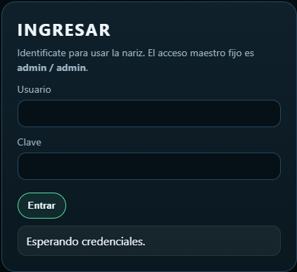

Despues de ingresar correctamente, la web muestra la pantalla principal y en la parte superior indica con que rol se esta trabajando.

---

## 6. Vista general de la pantalla principal

La web tiene tres areas principales:

- `Graficos`
- `Archivos`
- `Configuracion`

La opcion `Configuracion` solo aparece si el usuario tiene permiso para operar.

En la cabecera tambien se ve:

- fecha y hora del equipo
- rol del usuario
- botones de navegacion

### 6.1. Para que sirve cada boton superior

- `Graficos`
  Lleva a la vista donde se observan los valores actuales y la tendencia reciente.

- `Archivos`
  Lleva a la lista de archivos CSV guardados en la memoria SD.

- `Configuracion`
  Solo aparece para usuarios de operacion. Permite cambiar tiempos, hora, WiFi y usuarios.

- `Salir`
  Cierra la sesion actual.

### Imagen 2. Pantalla principal completa

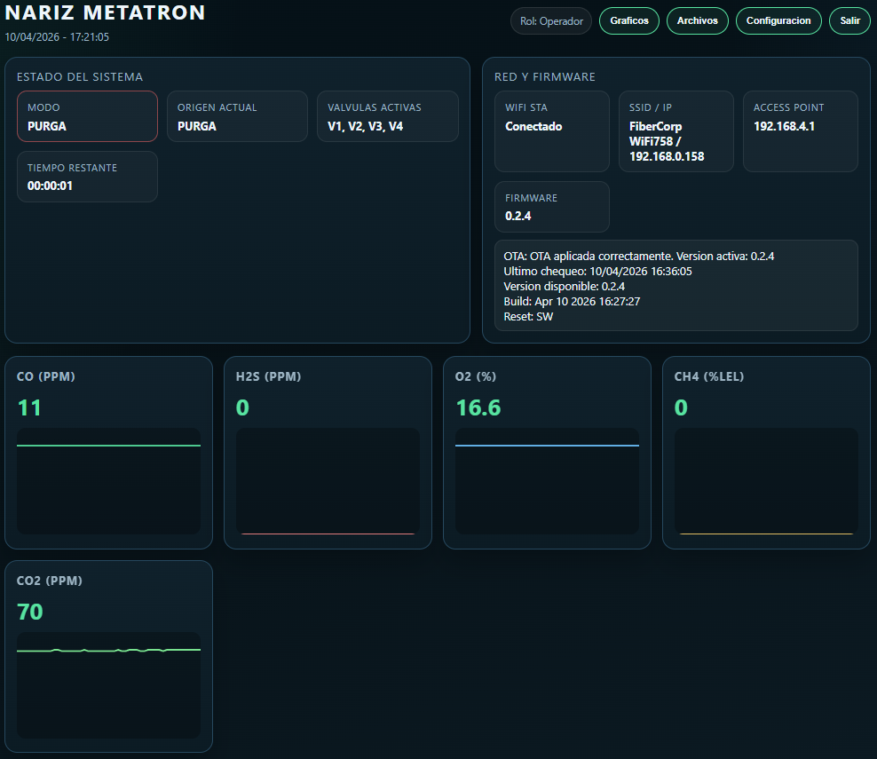

---

## 7. Panel "Estado del sistema"

En este panel se ve el estado actual de funcionamiento.

Los datos principales son:

- `Modo`
- `Origen actual`
- `Valvulas activas`
- `Tiempo restante`

### 7.1. Significado de "Modo"

Los modos que puede mostrar el sistema son:

- `MUESTRA`
  El equipo esta tomando muestra desde una valvula activa.

- `PURGA`
  El equipo esta haciendo purga entre dos muestras distintas.

- `PURGA_IDLE`
  No hay valvulas de muestra activas. El sistema queda con purga abierta.

### 7.2. Significado de "Origen actual"

Indica desde que valvula se esta tomando muestra en ese momento.

Ejemplos:

- `V1`
- `V2`
- `V3`
- `V4`
- `PURGA`
- `PURGA_IDLE`

### 7.3. Significado de "Valvulas activas"

Muestra que valvulas estan habilitadas en la configuracion actual.

### 7.4. Significado de "Tiempo restante"

Muestra cuanto falta para que termine la etapa actual.

Si aparece `Sin cambio automatico`, normalmente significa que el sistema esta trabajando de forma continua sin cambio de etapa en ese instante.

### Imagen 3. Panel Estado del sistema

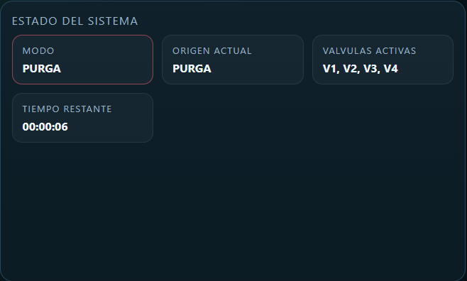

---

## 8. Panel "Red y firmware"

Este panel informa:

- estado del WiFi del sitio
- nombre de la red e IP local
- IP del Access Point
- version del firmware
- estado resumido del sistema de actualizacion

Para el usuario comun, lo mas importante es:

- saber por donde entrar al equipo
- confirmar si esta conectado al WiFi
- verificar la version activa si fue informado un cambio de software

### Imagen 4. Panel Red y firmware

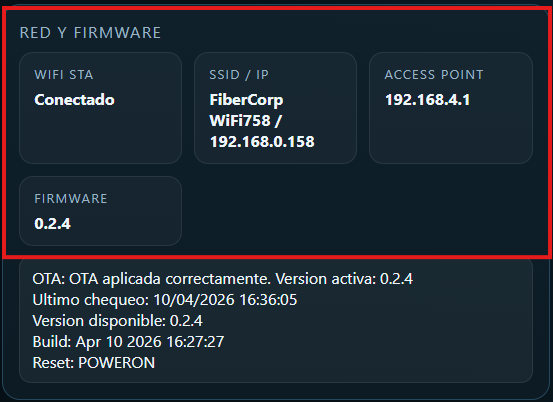

---

## 9. Pantalla "Graficos"

En la vista `Graficos` se muestran las variables medidas por los sensores.

Actualmente se visualizan:

- `CO`
- `H2S`
- `O2`
- `CH4`
- `CO2`

Cada tarjeta muestra:

- el valor actual
- un grafico simple con la tendencia reciente

### 9.1. Como leer los graficos

Los graficos sirven para ver si una variable:

- esta estable
- esta subiendo
- esta bajando
- tiene cambios bruscos

### 9.2. Recomendaciones de uso

- mirar primero el valor actual
- despues mirar si la tendencia acompana ese valor
- si se observa un cambio brusco inesperado, avisar al responsable

### Imagen 5. Pantalla Graficos completa

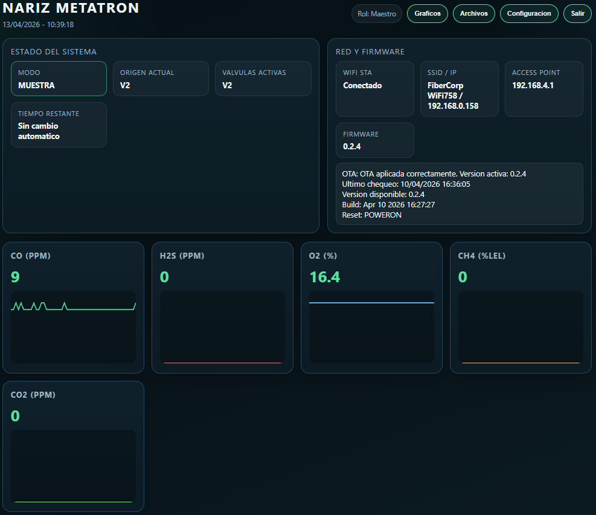

### Imagen 6. Detalle de tarjetas de graficos

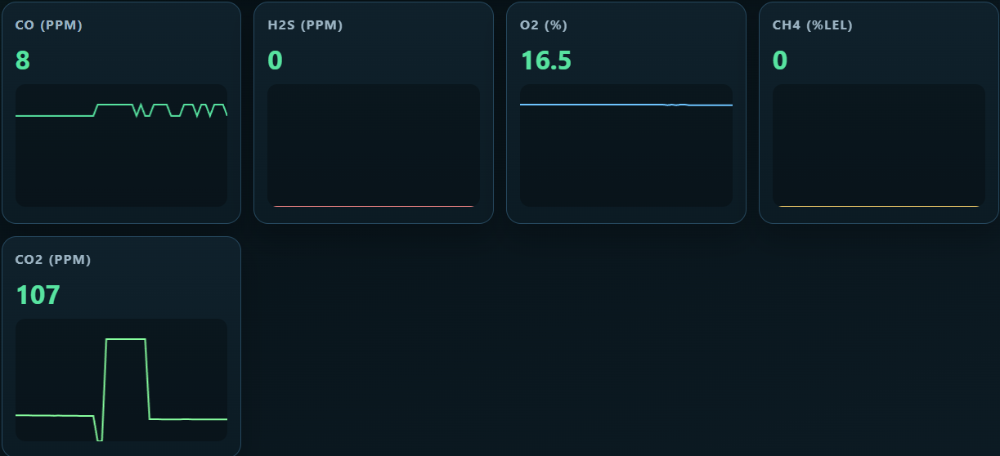

---

## 10. Pantalla "Archivos"

En `Archivos` se ve la lista de archivos CSV guardados en la memoria SD.

Cada fila muestra:

- nombre del archivo
- tamano
- acciones disponibles

### 10.1. Descargar un archivo

1. Entrar en `Archivos`.
2. Buscar el archivo deseado.
3. Presionar `Descargar`.

El navegador descargara el archivo al equipo o telefono desde donde se esta consultando.

Despues de descargar:

- revisar la carpeta de descargas del dispositivo
- confirmar que el archivo se abrio correctamente
- si el archivo se va a compartir, renombrarlo solo si no afecta la trazabilidad requerida por la planta

### 10.2. Borrar un archivo

Esta accion solo esta disponible para usuarios de operacion.

1. Entrar en `Archivos`.
2. Buscar el archivo.
3. Presionar `Borrar`.
4. Confirmar la eliminacion.

### 10.3. Recomendacion importante

Antes de borrar un archivo:

- confirmar que ya fue descargado
- confirmar que ya no se necesita
- evitar borrar archivos del dia en curso sin autorizacion

### Imagen 7. Pantalla Archivos completa

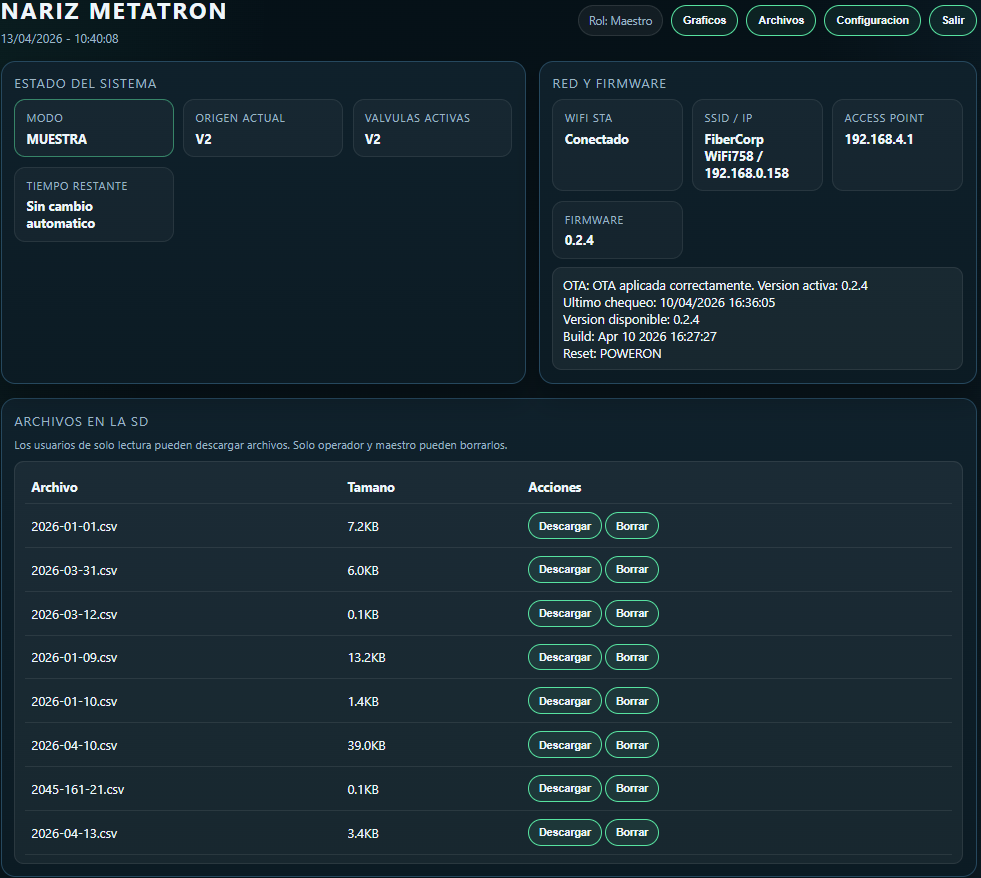

### Imagen 8. Detalle del bloque de archivos

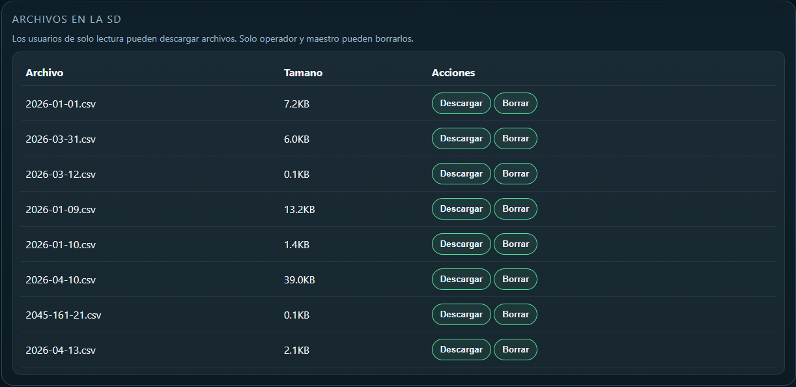

---

## 11. Pantalla "Configuracion"

La pantalla `Configuracion` solo esta disponible para usuarios de operacion.

Dentro de esta pantalla hay varios bloques:

- `Programa de valvulas`
- `Fecha y hora`
- `WiFi del sitio`
- `Seguridad`

La parte de actualizacion remota puede no estar visible para los usuarios operativos comunes.

### Imagen 9. Pantalla Configuracion completa

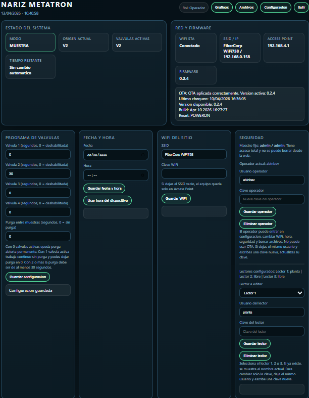

---

## 12. Programa de valvulas

En este bloque se define:

- cuanto tiempo muestrea cada valvula
- cuanto dura la purga entre muestras

Cada valvula tiene un campo en segundos.

### 12.1. Como funciona el valor de cada valvula

- `0` significa valvula deshabilitada
- de `30` a `86400` significa valvula habilitada

`86400` segundos equivalen a `24 horas`.

### 12.2. Regla de purga

El campo `Purga entre muestras` tambien se carga en segundos.

Reglas:

- si hay `0` valvulas activas, el equipo queda en `PURGA_IDLE`
- si hay `1` sola valvula activa, el equipo trabaja continuo y la purga puede quedar en `0`
- si hay `2` o mas valvulas activas, la purga debe ser como minimo de `30 segundos`

### 12.3. Como cambiar la programacion

1. Entrar en `Configuracion`.
2. Ir al bloque `Programa de valvulas`.
3. Cargar los tiempos deseados.
4. Presionar `Guardar configuracion`.

Despues de guardar:

1. esperar el mensaje de confirmacion
2. volver al panel principal
3. revisar `Modo`, `Origen actual` y `Valvulas activas`
4. confirmar que la secuencia coincida con lo que se quiso programar

### 12.4. Ejemplos practicos

Ejemplo A:

```text
Valvula 1 = 60
Valvula 2 = 0
Valvula 3 = 0
Valvula 4 = 0
Purga = 0
```

Resultado:

- solo toma muestra de V1
- trabaja continuo
- no hace purga entre ciclos

Ejemplo B:

```text
Valvula 1 = 30
Valvula 2 = 45
Valvula 3 = 0
Valvula 4 = 60
Purga = 30
```

Resultado:

- toma muestra de V1, V2 y V4
- hace purga entre una muestra y la siguiente

### 12.5. Recomendaciones importantes

- si no se desea usar una valvula, escribir `0`
- no dejar tiempos dudosos o cargados por error
- si todas las valvulas quedan en `0`, el sistema no toma muestras normales
- despues de cada cambio, controlar unos minutos el panel principal

### Imagen 10. Bloque Programa de valvulas

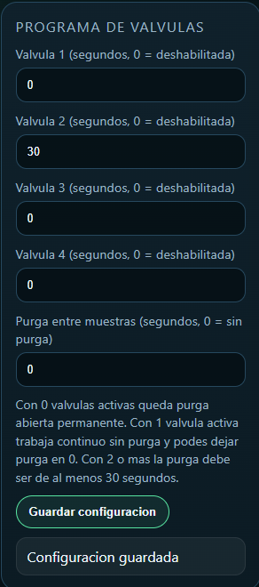

---

## 13. Fecha y hora

Este bloque se usa para corregir la fecha y hora del equipo.

Es importante porque:

- los archivos de la SD se guardan con fecha
- los registros deben quedar ordenados correctamente

### 13.1. Ajuste manual

1. Cargar la fecha.
2. Cargar la hora.
3. Presionar `Guardar fecha y hora`.

### 13.2. Usar hora del dispositivo

Si el telefono o la PC tienen la hora correcta:

1. Presionar `Usar hora del dispositivo`.
2. Verificar el mensaje de confirmacion.

### 13.3. Cuando conviene revisar la hora

- despues de una parada larga
- si la fecha mostrada no coincide con la real
- si los archivos aparecen desordenados por fecha

### Imagen 11. Bloque Fecha y hora

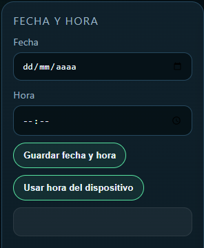

---

## 14. WiFi del sitio

Este bloque sirve para conectar el equipo al WiFi del lugar.

### 14.1. Como cargar una red WiFi

1. Escribir el nombre de la red en `SSID`.
2. Escribir la clave de la red en `Clave WiFi`.
3. Presionar `Guardar WiFi`.

### 14.2. Que pasa si se deja vacio el SSID

Si el campo `SSID` se deja vacio y se guarda:

- el equipo deja de intentar conectarse a la red del sitio
- queda disponible solo por su Access Point

### 14.3. Recomendaciones

- escribir exactamente el nombre de la red
- revisar mayusculas y minusculas en la clave si corresponde
- esperar unos segundos despues de guardar
- confirmar el resultado mirando el panel `Red y firmware`

### Imagen 12. Bloque WiFi del sitio

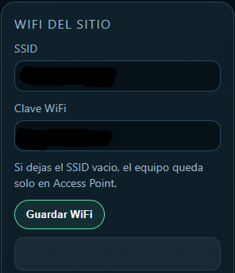

---

## 15. Seguridad

Este bloque sirve para administrar usuarios operativos y usuarios de consulta.

### 15.1. Usuario de operacion

En la pantalla se muestra si ya existe un operador y cual es su nombre.

Acciones posibles:

- crear un operador nuevo
- cambiar usuario del operador
- cambiar la clave del operador
- eliminar el operador

### 15.2. Como cambiar solo la clave del operador

1. Dejar el mismo nombre de usuario.
2. Escribir una clave nueva.
3. Presionar `Guardar operador`.

Si quien hace el cambio esta logueado como operador, la web mantiene la sesion con la clave nueva.

Si se elimina el operador actual mientras esta usando la web, la sesion se cerrara y habra que volver a ingresar con otro usuario autorizado.

### 15.3. Lectores o usuarios de solo lectura

La pantalla permite administrar `Lector 1`, `Lector 2` y `Lector 3`.

Cada lector:

- puede entrar a la web
- puede ver graficos
- puede descargar archivos
- no puede borrar
- no puede cambiar configuracion

### 15.4. Como cargar o editar un lector

1. En `Lector a editar`, elegir `1`, `2` o `3`.
2. Verificar si ese lector esta libre o ya tiene un nombre.
3. Escribir usuario.
4. Escribir clave.
5. Presionar `Guardar lector`.

### 15.5. Como cambiar solo la clave de un lector

1. Elegir el lector correspondiente.
2. Dejar el mismo usuario.
3. Escribir la clave nueva.
4. Presionar `Guardar lector`.

### 15.6. Como eliminar un lector

1. Elegir el lector.
2. Presionar `Eliminar lector`.

### 15.7. Buenas practicas de uso de usuarios

- usar nombres simples y faciles de recordar
- no repetir usuarios entre distintas personas
- cambiar claves si hubo cambio de personal
- entregar a cada usuario solo el acceso que realmente necesita

### Imagen 13. Bloque Seguridad

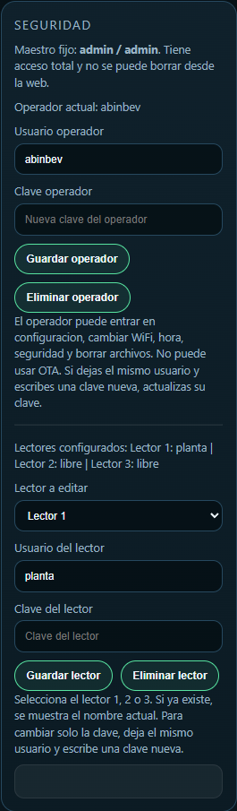

---

## 16. Mensajes y confirmaciones

Debajo de cada bloque suele aparecer un mensaje.

Ese mensaje indica si la accion:

- salio bien
- tuvo un error
- necesita revisar algun dato

Ejemplos:

- `Configuracion guardada`
- `WiFi guardado. Intentando conectar.`
- `Hora actualizada`
- `Usuario operador actualizado`
- `Usuario de solo lectura guardado`

---

## 17. Recomendaciones de operacion diaria

- entrar siempre con el usuario correspondiente al trabajo a realizar
- no usar un usuario de operacion si solo se van a mirar graficos
- revisar fecha y hora si los archivos no parecen correctos
- no borrar archivos sin confirmar antes la descarga
- despues de cambiar la programacion de valvulas, mirar el panel de estado para confirmar que la secuencia sea la esperada
- al terminar, salir de la sesion

---

## 18. Problemas comunes y que hacer

### 18.1. No puedo entrar

Revisar:

- que el usuario este bien escrito
- que la clave este bien escrita
- que el equipo este accesible por IP
- que el navegador siga conectado a la red correcta

Si sigue sin entrar, avisar al responsable.

### 18.2. No veo la opcion Configuracion

Probablemente el usuario actual es de solo lectura.

### 18.3. No puedo borrar archivos

Probablemente el usuario actual no tiene permiso de borrado.

### 18.4. La fecha u hora estan mal

Entrar en `Configuracion`, bloque `Fecha y hora`, y corregir usando:

- carga manual
- o `Usar hora del dispositivo`

### 18.5. El equipo no conecta al WiFi del sitio

Revisar:

- nombre de red
- clave
- distancia o calidad de senal

Mientras tanto, se puede seguir entrando por el Access Point del equipo.

### 18.6. No se generan muestras

Revisar en `Programa de valvulas`:

- si las valvulas estan en `0`
- si la configuracion fue guardada correctamente

Si todas las valvulas estan en `0`, el equipo queda en purga sin hacer muestreo normal.

---

## 19. Buenas practicas para capturas de pantalla del manual

Al agregar imagenes a este manual:

- no mostrar usuarios sensibles
- no mostrar claves
- evitar mostrar informacion interna reservada
- usar capturas claras, bien recortadas y legibles
- si hay datos sensibles, taparlos antes de insertar la imagen

---

## 20. Resumen rapido de uso

### Usuario de solo lectura

1. Ingresar.
2. Ver `Graficos`.
3. Entrar a `Archivos` si hace falta descargar.
4. Salir.

### Usuario de operacion

1. Ingresar.
2. Revisar estado del sistema.
3. Cambiar configuraciones si es necesario.
4. Confirmar mensajes de guardado.
5. Revisar que el sistema quede en el estado esperado.
6. Salir.

---

## 21. Espacio final para observaciones internas

Agregar aqui notas propias de la planta, por ejemplo:

- nombre del responsable por turno
- procedimiento local de respaldo de archivos
- politica local de cambio de claves
- red WiFi habitual del sector

**Espacio para captura agregada por la planta**

Si hace falta, agregar aqui una captura propia de la planta para reforzar la capacitacion o documentar algun procedimiento interno del sector.
